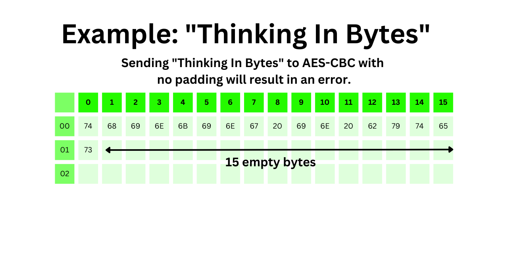
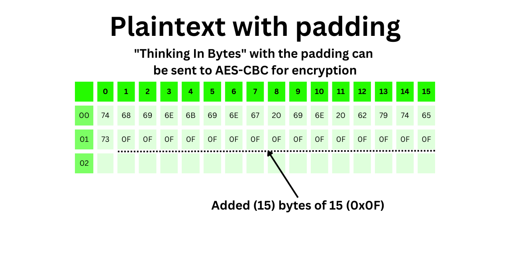
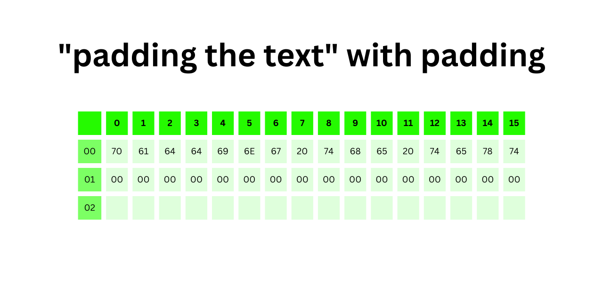

+++
categories = [ "technology" ]
title = "AES-CBC Padding Explained"
description = "The padding technique used in AES-CBC Encryption"
slug = "aes-cbc-padding-explained"
date = "2023-08-18T02:53:37.112Z"
tags = [ "cryptography", "python" ]
draft = false
preview = "@static/img/thinkinginbytes_feature_image.png"
+++

Encrypting plaintext using Advanced Encryption Standard (AES) in Cipher Block Chaining (CBC) mode
requires the plaintext to be a multiple of 16 bytes long. All plaintext is padded before encryption.
The padding method is described in Section 6.3 of
[PKCS #7](https://www.rfc-editor.org/rfc/rfc5652).
<!--more-->
## The Padding Technique

If the last block of the plaintext message has 1 byte (e.g., if the plaintext is 17, 33, or 49
bytes), then 15 bytes of the value 0x0f (15) are added to the end of the plaintext. Finding the
number of bytes in the last block is trivial using modulo math in python.

```python
plaintext = b"Thinking In Bytes"
len(plaintext) % 16
1
```

The output is the number of bytes in the last block. In this example, the plaintext message
*Thinking In Bytes* has a length of 17 bytes, so 1 byte remains in the last block.
An illustration of the last block is:



To determine which value to use for padding, the formula would look like this:

```python
BLOCKSIZE = 16
plaintext = b"Thinking In Bytes"
padding = BLOCKSIZE - len(plaintext) % BLOCKSIZE
```

The value of the padding is 15.
```python
padding
15
```

The padded plaintext for "Thinking In Bytes" would look like this:



This pattern continues with other dangling bytes. If the last block of the plaintext message has 2
bytes (e.g., the plaintext is 18, 34, 50… bytes), then 14 bytes of 0x0e (14) are added to the end of
the plaintext.

## Do Perfect Plaintext Messages Get Padding?

The PKCS 7 standard says this:

> The padding can be removed unambiguously since all input is padded,
> including input values that are already a multiple of the block size,
> and no padding string is a suffix of another.

If the plaintext message is an exact multiple of the block size (e.g., 16, 32, 48...),
`len(plaintext) % BLOCKSIZE == 0` then add 16 bytes of 0x00 (0) to the end.
Here is an example of plaintext that is an exact multiple of 16 bytes, `padding the text`.



As the standard says, padding can be removed after decryption because all plaintext is padded
*including input values that are already a multiple of the block size*. This is all for now. As a
follow up to this post, I am creating a python script that demonstrates how a padding function might
look.
