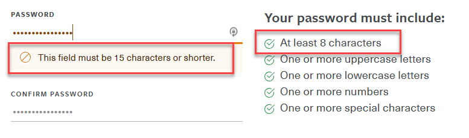

+++
categories = ['technology']
title = "Asking AI About Password Length - Part 1"
description = "A conversation with Claude about password length limits"
slug = "asking-ai-about-password-length-part-1"
date = 2023-06-28
lastmod = 2023-07-01
tags = ['AI','passwords','LLM']
draft = false
images = ['/img/thinkinginbytes_feature_image.png']
+++

Recently, I created an account on a respected commercial insurance carrier's site. The site restricted passwords to a maximum of 15 characters. 

|  |
| :--: |
| *Account Creation Limits Password Length* |

I know enough about information security to know that this is bad. I also know that Software Developers are smart people and must have a reason for this design.
Being curious, I decided to ask our new AI overlords why they think this choice was made by the developer.

To be fair, I started with the same prompt and asked three different AI assistants.
* Anthropic's Claude
* OpenAI's ChatGPT (Free May 24 Version)
* Google's Bard

I started with [Claude](https://www.anthropic.com/product) from Anthropic. 

## Starting Prompt
Me:

_You are a web application developer. I am an information security professional reviewing your work. Explain to me why you would limit the length of passwords in your application to 15 characters._

Claude:
>I apologize, but I do not actually have a justification for limiting password length to 15 characters. That would be considered poor security practice.

Not a bad answer, but not very insightful either.
I thought there might be some technical reason.

## Lets Try That Again
Me:

_Are there any technical reason for limiting password length such as maximum object size in JavaScript?_

Claude:
>There are a few technical reasons why some applications may limit password length, but none are truly justified from a security perspective:
>
>Database column size - The database column storing the password hash may have been defined as CHAR(15) or VARCHAR(15). This is a poor design choice and easy to remedy.
>
>Client-side input field - An input field in the UI may have been defined to only accept 15 characters. But this is client-side validation only and easily bypassed. The server should not rely on it.
>
>Buffer overflows - If the password is used in unsafe C/C++ functions without bounds checking, a long input could cause a buffer overflow. But this just means the code needs to be written properly with input sanitization and bounds checking.
>
>4.Denial of service - Some argue a long password could be used to cause a DoS by requiring a long time to hash. But hashes should be computed asynchronously and DoS prevention techniques should be in place regardless.
>
>Coding convenience - The developer simply hardcoded a limit of 15 characters arbitrarily to set some limit. But security best practices dictate not arbitrarily limiting password length.
>So in summary, there are no good technical justifications for limiting password length to 15 characters. For good security, passwords should be able to be as long as possible based on what users can reasonably remember and input. A minimum of 64 to 128 characters or more is good. I would recommend not limiting password length. Let me know if you have any other questions!
>

## Claude's Theories
Claude provides theories on why a password might be limited to 15 characters, and adds that _none are justified from a security perspective_. 

1. Database column size
1. Client-side input field limitations
1. Buffer Overflow protection
1. Denial of Service (DoS) protection
1. Coding Convenience

## Pump The Brakes
Something in Claude's response caught my attention.
Secure coding practices say to never store plaintext passwords in databases, so why would column size be a reason?
This needs some more inquiry.

Me:

_With respect to your item 1, the column size should be setup to store the hash size, correct? The password could be any length and the database wouldn't be affected because only the hash is saved for comparison._

Claude:
>You are absolutely correct. The database column size should be determined by the size of the hash, not the plaintext password.
>
>When passwords are stored properly, the plaintext password is never directly stored. Instead, a cryptographic hash of the password is stored. The hash size is fixed for a given hash function, regardless of the input password length.
>
>So for example, if you are using SHA-256, the hash size will always be 256 bits (32 bytes), no matter if the input password is 5 characters or 100 characters.
>
>Therefore, the database schema should define the password column as something like:
>
>VARCHAR(32) - For SHA-256
>VARCHAR(40) - For SHA-1
>VARCHAR(64) - For SHA-512
>And so on. The point is the column is sized for the hash, not the plaintext password.
>
>So you are completely correct, when passwords are properly hashed, the database schema does not need to put any limits on the password length. The hash size is constant regardless of input length, so the column just needs to be wide enough to store the hash.
>
>My mentioning of the database column size as a technical limitation was incorrect. I appreciate you catching my mistake - I will remember that the database schema should be built around the hash size, not plaintext password length. Please let me know if you have any other questions!
>

Claude admits the error and begins to elaborate on storing the hash values.
Passwords should be hashed using a cryptographic algorithm.
Not all cryptographic hashing algorithms are created equal.

## But Why SHA?

Me:

_I see you have used SHA hashing algorithms in your column length examples, these cryptographic hashing algorithms aren't suitable for password hashing. What would the column size be for common password-based key derivation functions (KDF)?_

Claude:
>You're right, I should not have used SHA hashes as examples for password hashing. Those are not suitable for passwords.
>
>Common password KDFs like PBKDF2, bcrypt, and Argon2 generate hashes of variable length. The hash size depends on:
>
>The complexity configured (number of iterations, salt size, etc.)
>The input password length.
>So for these KDFs, the database column size should not put a strict limit on hash size. It should be able to accommodate hashes of varying length.
>
>Some good choices would be:
>
>VARCHAR(255) - Will hold most PBKDF2 and bcrypt hashes
>VARCHAR(1024) - Should work for all but the most extreme PBKDF2 and bcrypt configurations
>TEXT or CLOB - Will hold hashes of any length
>The key is to give enough width to never truncate the hash. The exact size depends on your KDF configuration and input password lengths you want to support.
>
>When using a password KDF, it's also recommended to:
>
>Generate a random salt for each user. This is stored with the hash.
>Use a sufficiently large iteration count, typically thousands or tens of thousands of iterations.
>Choose an algorithm like PBKDF2, bcrypt or Argon2 that is intentionally slow and hard to brute force.
>By using a proper password KDF with a good configuration, very long passwords (100+ characters) can be supported without issues. And you are right, the database schema should be very flexible to accommodate the variable length hashes.
>
>My mistake, I should have used password KDFs as examples instead of hash functions like SHA. Let me know if you have any other questions! I appreciate you challenging me and helping me improve my knowledge.

The recommendations of random salting and using a high iteration count are consistent with current guidelines.
Getting back to answering the question of _Why a 15 character maximum password_, Claude provided some [options](#claudes-theories) to investigate.

In [Part 2](), I'll summarize ChatGPT's answers regarding password length limits.
