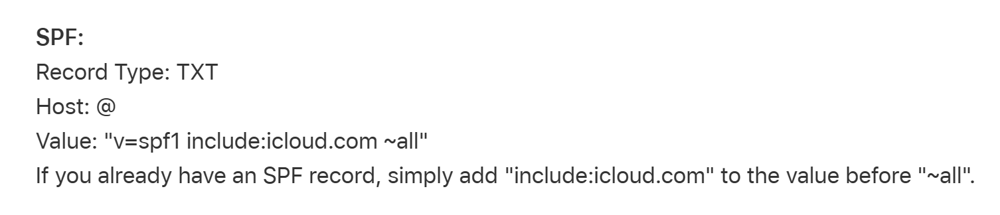
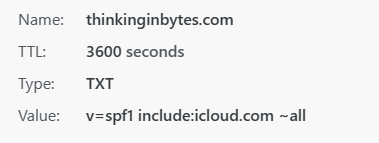

+++
categories = ['technology']
title = "Fixing SPF for iCloud Custom Email Domains"
description = "Removing double quotes in the SPF record fixed validation failure"
slug = "fix-icloud-custom-email-spf-failure"
date = 2023-07-04
lastmod = 2023-07-05
tags = ['icloud','email','DNS']
draft = false
+++

Subscribers to Apple's iCloud+ have the option of using custom domains with iCloud Mail.
You can either purchase a domain through iCloud or bring your own domain.
The experience here relates to the _bring your own domain_ option.

Configuring the domain to work with iCloud Mail requires several new domain DNS records.
I manage the DNS records for my domain on Netlify.
Apple verifies these records before completing the setup.

## DNS Records
The [Apple instructions](https://support.apple.com/en-us/HT212524) give these DNS entries:

* TXT - Special Code to verify ownership
* MX #1
* MX #2
* DKIM
* SPF (TXT Record with SPF Value)

Apple's SPF record details are:


Note, the _Value_ for this record includes double quotes.

```bash
Value: "v=spf1 include:icloud.com ~all"
```

## The Problem: SPF Record Validation Failure

After entering all the DNS records per instructions, the SPF part of Apple's validation failed.

I attempted to fix the SPF failure by:

* Deleting the SPF DNS record, then adding it again
* Abandoning the entire custom domain setup process and then restarting

Neither of these actions resolved the problem.
I did some internet searches about the double quotes in the SPF Record Value.
The wisdom of the internet said that the double quotes `"` are needed because there are spaces in the _Value_.

## The Solution

For reference, my DNS records are managed by [Netlify](https://www.netlify.com).
Just to confirm that the double quotes _really are needed_, I decided to remove them from the SPF record and retry the validation.
This fixed the SPF validation failure.

> For my domain with DNS hosted on Netlify, I had to remove the double quotes from Apple's provided Value.

After removing the double quotes, the SPF validation passed and the setup process finished.
This is how the SPF record looks in Netlify:

