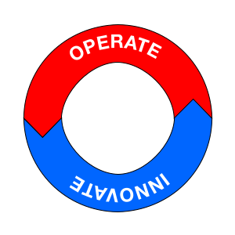

+++
categories = [ "business" ]
title = "Operate Versus Innovate"
description = "the two modes of work in a small business should be distinct activities"
slug = "operate-innovate"
date = "2024-01-25T01:17:18.432Z"
tags = [ ]
draft = "true"
keywords = [ ]
+++

<!-- TOC -->

- [Operating](#operating)
- [Innovating](#innovating)
- [Don't Do Both At The Same Time](#dont-do-both-at-the-same-time)

<!-- /TOC -->
For many years, I misunderstood the concept of "Continuous Improvement".
In my mind, I would always be alert for opportunities to change a process for the better.
Using that definition has a major drawback.
Every time I found an opportunity for improvement, the real work stopped and the work around  how to improve it starts.
Disrupting the work and creating inefficiencies instead of fixing them.

My definition has changed.
_Continuous Improvement_ is more about the idea of _never being finished improving_ than _constantly changing the process_ while trying to use it.
Improving a process should be scheduled activity.
Scheduled during a time when you are NOT using the process.

In his book
[Leadership is Language](https://www.thriftbooks.com/w/leadership-is-language-the-hidden-power-of-what-you-sayand-what-you-dont_l-david-marquet/26718683/?resultid=ad5392bf-0f8f-4a71-b4d6-7aa411e1a9cc#edition=21308786&idiq=36315543),
L. David Marquet describes these modes as Red work and Blue work.

 + Red work = Doing, executing the work of the business. Completing a process, producing a part; the goal is to complete.
 + Blue work = Collaborative reflection that embraces change; goal is to improve.

I prefer more descriptive terminology:

+ Operating = The act of completing a routine task or business process.
+ Innovating = The act of improving a task or process.

## Operating

The act of completing a routine task I will call _Operating_.
This is working _IN_ the business.
While _Operating_, you may find parts of the process that could be tweaked, improved, or changed to decrease variability or increase quality.
This puts the worker in a difficult position, they are trying to complete a task but also decide if they have time to change the process.
Is is doesn't make sense to try and change a process while you are executing it.

> Your car is _Operating_ every time you drive it.
> It is completing its assigned task, getting you to your destination.
> You wouldn't ask a mechanic to tune-up the engine while you are driving it.
> You take car out of its daily service routine and have it modified.

## Innovating

This is working _ON_ the business.
Set aside time to consider all of your ideas.
Make sure this is a time where you are not actively working on completing the task you are trying to improve.

Continuous improvement doesn't mean improving while you work, it means having a rhythm of work/improve, operate/innovate.
You won't get stuck when you see something that could be changed.
Simply make a note of the idea and and discuss the next time you are in Innovate mode.

## Don't Do Both At The Same Time

Operating should be focused on completing the work.
This is, after all, why you are employed.
Ideas about improvement or questions about the process should be recorded and saved for later.

What operators need is time dedicated to _Innovate_ the process.
Innovating while you Operate is a recipe for lost productivity and low quality outcomes.
