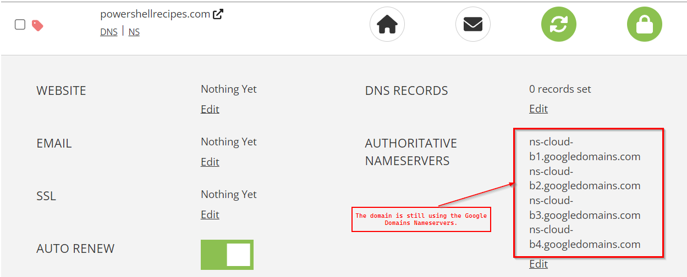

+++
categories = [ "technology" ]
title = "Transfer Your Google Domain To Porkbun"
description = "Instructions on how to transfer your domain registered with Google to Porkbun.com"
slug = "transfer-google-domain-porkbun"
date = "2023-09-04T19:24:34.816Z"
tags = [ "domain", "dns" ]
draft = false
+++

Google has decided to discontinue its domain registration service.
As of August 2023, the [Google Domains](https://domains.google.com) site displays this message:

> Google recently entered into an agreement for Squarespace, Inc. to acquire all domain name
> registrations from Google Domains, with the purchase subject to regulatory approval and customary
> closing conditions. If the transaction closes, you will become a Squarespace customer and,
> following a transition period, your customer and billing information, if applicable, will be
> transferred to Squarespace, at which point Squarespace's Privacy Policy and Terms of Service will
> apply.

I'm certain that Squarespace is a solid registrar, but I decided to move my domains to
[Porkbun](https://porkbun.com). Porkbun has a [blog
article](https://kb.porkbun.com/article/56-how-to-transfer-domain-to-porkbun) on how to transfer a
domain to them. The guide is great, but I wanted to show specifics related to moving from Google
Domains.

## Start With Google Domains
Start by logging in to your Google Domains account and selecting the *MANAGE* option for the domain you wish to transfer.

Under the *Registration Settings*, if the domain is locked, slide the button to
unlock it.

A window pops up with the *Authorization Code*.
Copy this code. 
You will need it in the next step.

## Enter Transfer Data Into Porkbun

With the authorization code copied to your clipboard, browse to the
[Porkbun Transfer Page](https://porkbun.com/transfer). Copy the Authorization Code into the *Auth
Code* field and fill the *Domain Name* field.

## Google Wants You To Confirm

Google will email you requesting confirmation of the transfer.
The message will look something like this:

## Wait For The Transfer

After confirming the transfer with Google, you must wait.
Once the transfer is completed between Google and Porkbun, Porkbun will email you.

## Double Check Domain Details

To confirm your domain settings in Porkbun, click the *Details* button for your domain.

This will show the settings the Porkbun inherited during the transfer.

>Note: If you were using default Nameservers on Google Domains, your Nameservers will still be set to Google Domains.

You can see in this image that the _Authoritative Nameservers_ still show Google Domains.

If you need to add DNS records, you will need to change your name servers to Porkbun.
This isn't difficult.
As soon as you try to manage DNS, Porkbun warns you that it must control the name servers before you use this feature.

Good luck.
